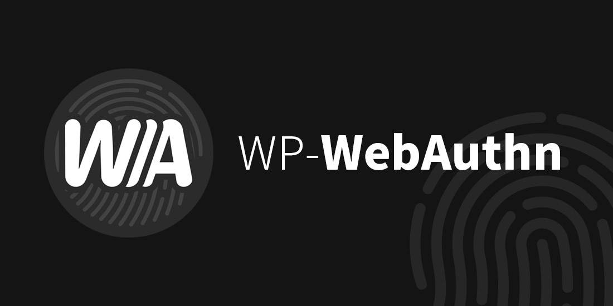

# WP-Webauthn Documentation

WebAuthn is a new way for you to authenticate in web. It helps you replace your passwords with devices like USB Keys, fingerprint scanners, Windows Hello compatible cameras and more while keep safe.

WP-WebAuthn is a plug-in for WordPress to enable WebAuthn on your site.

This is the documentation of WP-Webauthn plugin, which will help you to install, configure & troubleshoot WP-Webauthn.

This documentation is also available in other languages:

- [简体中文](https://doc.flyhigher.top/wp-webauthn/zh-CN/)

If you haven't install WP-Webauthn yet, you can install it from [WordPress plugin directory](https://wordpress.org/plugins/wp-webauthn/) in the dashboard.
