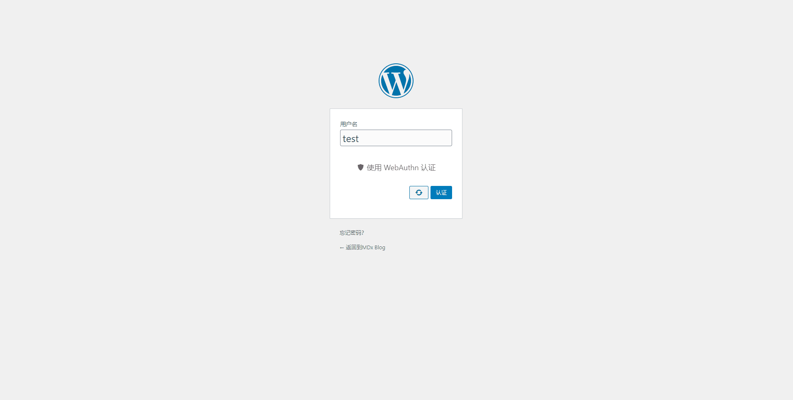
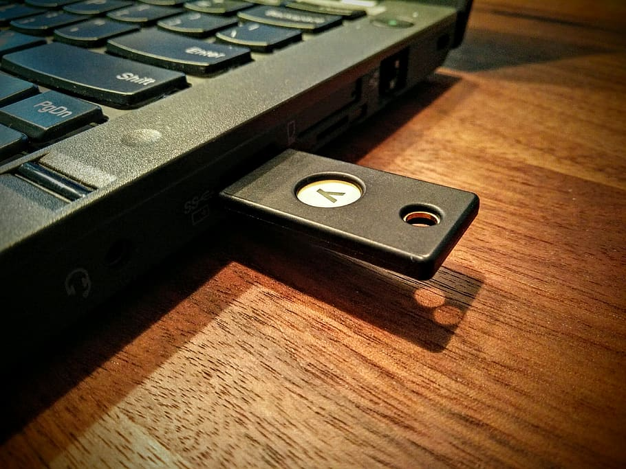
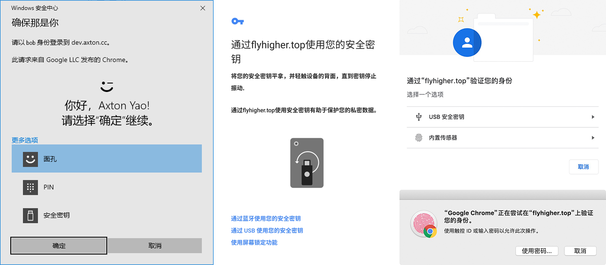

# WebAuthn

## What is WebAuthn

WebAuthn is a next-generation network authentication technology designed to make network authentication more efficient and secure by replacing the password with USB authenticators, fingerprint recognition, Windows Hello compatible cameras and more.

As a user, you don't have to care about the technical details behind WebAuthn. Just install and enable this plugin and you can experience the latest web authentication technology on your WordPress site.

For technical details on WebAuthn, you can check out [this article](https://flyhigher.top/develop/2160.html) (in Chinese).

## Usage process of WebAuthn

In the past, U2F devices such as USB authenticators were often used as "second-factor authenticators," which means they were just a second barrier after passwords. Now, with WebAuthn, we can use a larger range of authenticators, including U2F devices, to replace passwords and make the authentication process more efficient without compromising security.

To use WebAuthn, you need to determine if your device supports WebAuthn. The latest version of browsers and operating systems generally support WebAuthn, so consider updating your browser and operating system if you find that you cannot use WebAuthn properly.

WebAuthn is very simple to use. Step 1, enter a username (sometimes not even required).

Step 2, click the authentication button.

Step 3, perform a simple confirmation on the authenticator.

Step 4, you're logged in!

## Which devices support WebAuthn

To use WebAuthn, in addition to server-side support, you'll need browser support and a suitable authenticator.

In terms of browsers, most of the latest modern browsers on desktop support WebAuthn, but there are some limitations on the mobile side.

| Chrome | Firefox(Desktop) | Firefox(Mobile) | Edge(Desktop) | Edge(Mobile) | Safari(Desktop) | Safari(Mobile) | Opera(Desktop) | Opera(Mobile) |
| :----: | :----: | :----: | :----: | :----: | :----: | :----: | :----: | :----: |
| 67+ | 60+ | 60+[1] | 18+ | No[2] | 13+ | 13.3+[3] | 54+ | No |

[1] Firefox(Mobile)'s support is imperfect, while Firefox Beta(Mobile) supports WebAuthn but it's unuseable.

[2] Edge(Mobile) supports WebAuthn but it's unuseable.

[3] Safari (Mobile) supports only external authenticators and does not support Touch ID or Face ID.

Many customized browsers on mobile devices like Samsung Browser and Yandex Browser, do not support WebAuthn currently. In addition, since WebAuthn involves external authenticators, TPM and more, the user's operating system can also have an impact on the usability of WebAuthn. The following is some information to be aware of:

- Only Edge can provide full support on Windows version below than Windows 10 1903 while other browsers can only use external authenticators such as USB keys; all browsers in 1903+ can bring full WebAuthn support through Windows Hello
- Android requires Google Services to be installed and turned on
- WebAuthn is not supported by versions below iOS 13.3, and 13.3+ has limited support

For authenticators, WebAuthn doesn't have many limitations. The first and most widely used authenticator is USB key like Yubikey. USB keys that include U2F or FIDO2 feature can be used as authenticators for WebAuthn.

WebAuthn can also use "built-in authenticators". For Android devices, users can authenticate by fingerprint or lock screen password; for Windows devices, users can use Windows Hello to authenticate by facial recognition, fingerprint, PIN, etc.; for MacOS devices, users can authenticate by fingerprint recognition.

