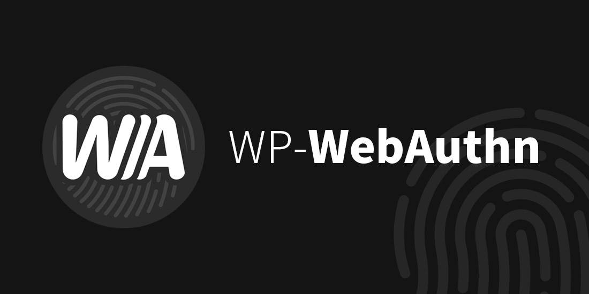

# WP-Webauthn 文档

WebAuthn 是新一代网络认证技术，旨在通过 USB 认证器、指纹识别、Windows Hello 等替代密码以使网络认证更加高效且安全。

WP-WebAuthn 使你可以安全地且快速地通过 WebAuthn 登录你的 WordPress 站点而无需输入密码。

这是 WP-Webauthn 插件的文档。本文档会指导你安装及配置 WP-Webauthn，并解答一些常见问题。

本文档同时提供其他语言的版本：

- [English](https://doc.flyhigher.top/wp-webauthn/en-US/) 

如果你还没有安装 WP-Webauthn，可以在 WordPress 后台搜索安装。
