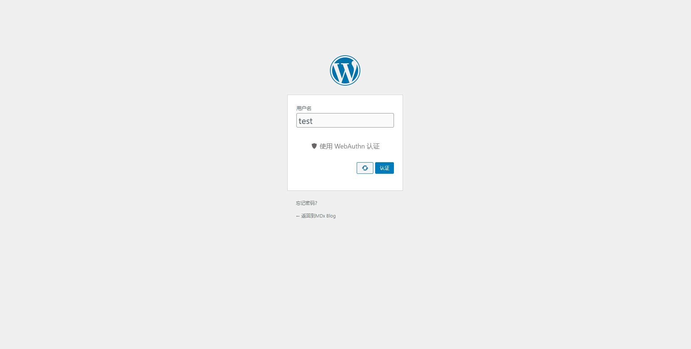

# WebAuthn

## WebAuthn 是什么

WebAuthn 是新一代网络认证技术，旨在通过 USB 认证器、指纹识别、Windows Hello 等替代密码以使网络认证更加高效且安全。

作为用户，你不必关心 WebAuthn 背后的技术细节，只需安装并启用本插件，你就可以在你的 WordPress 站点上体验最新的网络认证技术。

要了解 WebAuthn 的技术细节，你可以查阅[这篇文章](https://flyhigher.top/develop/2160.html)。

## WebAuthn 的使用流程

在以前，USB 认证器等 U2F 设备常被用作“第二因素认证器”，这意味着它们只是密码之外的第二道屏障。现在，借助 WebAuthn，我们可以使用包括 U2F 设备在内的一系列认证器代替密码，在使身份认证过程更高效的同时没有降低安全性。

要使用 WebAuthn，你首先要确定你的设备是否支持 WebAuthn。最新的浏览器和操作系统普遍支持 WebAuthn，如果你发现你不能正常使用 WebAuthn，请考虑更新浏览器和操作系统。

WebAuthn 使用非常简单。第一步，输入用户名（有时甚至不需要）。

第二步，点击认证按钮。

第三步，在你选择的认证器上进行简单的确认。

第四步，稍等片刻，你就已经登录了！

## 哪些设备支持 WebAuthn

要使用 WebAuthn，除了服务器端支持外，你还需要浏览器的支持以及合适的认证器。

在浏览器方面，绝大多数最新的桌面现代浏览器都支持 WebAuthn，但在移动端支持还有些限制。

| Chrome | Firefox(Desktop) | Firefox(Mobile) | Edge(Desktop) | Edge(Mobile) | Safari(Desktop) | Safari(Mobile) | Opera(Desktop) | Opera(Mobile) |
| :----: | :----: | :----: | :----: | :----: | :----: | :----: | :----: | :----: |
| 67+ | 60+ | 60+[1] | 18+ | 不支持[2] | 13+ | 13.3+[3] | 54+ | 不支持 |

[1] Firefox(Mobile) 支持不完善，同时 Firefox Beta(Mobile) 支持 WebAuthn 但无法成功调用。

[2] Edge(Mobile) 支持 WebAuthn 但无法成功调用。

[3] Safari(Mobile) 仅支持外部认证器，无法调用 Touch ID 或 Face ID。

当然，大部分国产浏览器，以及 Samsung Browser 和 Yandex Browser，目前都不支持 WebAuthn。此外，由于 WebAuthn 涉及外部验证器和 TPM 可信平台模块等，用户的操作系统也会对 WebAuthn 的可用性造成影响。以下是一些需要注意的信息：

- Windows 10 1903 以下版本仅 Edge 能提供完整支持，其他浏览器只能使用 USB Key 等外部认证器；1903+ 中所有浏览器都可以通过 Windows Hello 带来完整的 WebAuthn 支持
- Android 需要安装并开启 Google 服务
- iOS 13.3 以下的版本不支持 WebAuthn，13.3+ 目前支持有限

对于认证器，WebAuthn 的限制并不多。首先使用最广泛的就是 Yubikey 等 USB Key 了。包含 U2F 或 FIDO2 功能的 USB Key 都可以作为 WebAuthn 的认证器使用。

此外 WebAuthn 也可以使用“内置认证器”而不是一定要 USB Key 等外部认证器。对于 Android 设备，用户可以通过指纹或是锁屏密码进行认证；对于 Windows 设备，用户可以通过 Windows Hello 实现通过面部识别、指纹、PIN 等方式认证；MacOS 设备则可以使用指纹识别进行认证。

